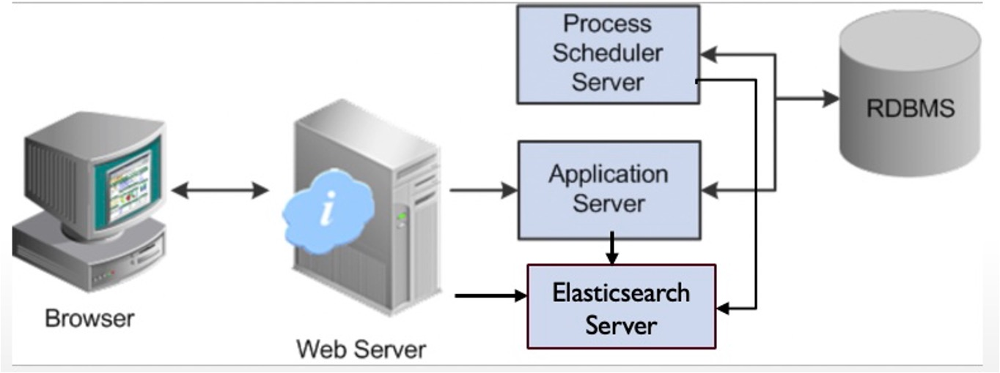
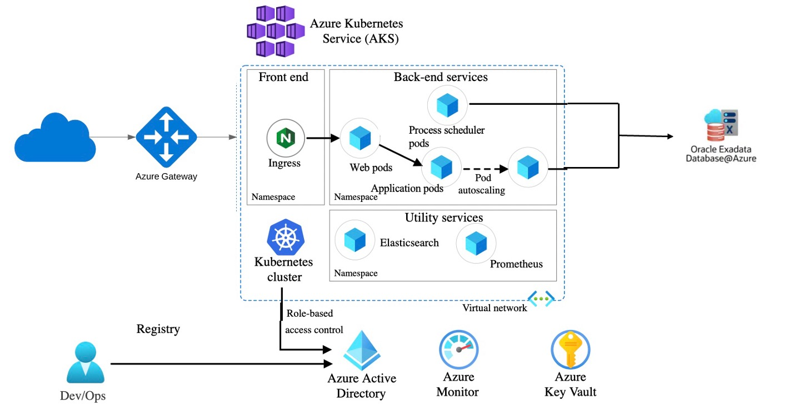

# On-Prem to Azure Cloud Migration: PeopleSoft ERP Case Study

A cloud migration architecture and strategy for moving an Oracle PeopleSoft ERP suite from on-premises infrastructure to Microsoft Azure. This case study covers the full migration approach — from high-level architecture and technology tradeoffs to phased delivery milestones, with first-class consideration for scalability, high availability, disaster recovery, and regulatory compliance.

## Overview

The objective: migrate an on-premises Oracle PeopleSoft ERP suite — running across web, application, and process-scheduler tiers on a backend Oracle Exadata database — to Azure, capturing the scalability and cost-efficiency benefits of the cloud while preserving reliability and compliance.

This repository contains the architecture design and migration strategy, including existing-state and proposed-state architecture diagrams (see the slides for full detail).

## Source system

The on-premises environment consists of:

- Web servers (RHEL 7)
- Application servers (RHEL 7)
- Process scheduler servers (RHEL 7)
- Elasticsearch servers
- Oracle 19 database on on-prem Exadata
- Oracle PeopleSoft ERP suite

## Target platform

- Azure Cloud Platform
- Azure Oracle Exadata Database Service (managed Oracle backend)
- Terraform for infrastructure provisioning
- Ansible for configuration management

## What the design covers

**Phased delivery roadmap** — a first-year migration plan broken into milestones, sequencing assessment, foundation build-out, workload migration, and cutover to minimize risk and downtime.

**High-level cloud architecture** — a proposed Azure target architecture mapping each on-prem tier to its cloud equivalent, with networking, security, and data-tier design.

### Existing Architecture

### Proposed Cloud Architecture

**Technology tradeoffs with justification:**
- *Containers vs Azure VMs* — analysis of which PeopleSoft tiers are good containerization candidates versus which are better suited to VMs, with the reasoning behind each choice.
- *CI/CD approach* — pipeline design for provisioning and configuration using Terraform and Ansible, with automated, repeatable deployments across environments.
- *Data migration approach* — strategy for migrating the Oracle backend to Azure's managed Exadata service with minimal disruption.

**Non-functional design** — explicit treatment of scalability, high availability, disaster recovery (HA & DR), and compliance with NIST 800-171 (or comparable framework).

**Cost optimization** — analysis of whether a straight lift-and-shift is the right approach, or whether a re-platforming strategy delivers better long-term cost efficiency.

## Files

- `OnPrem_to_Cloud_OIT.pdf` — full architecture and migration plan (PDF)
- `OnPrem_to_Cloud_OIT.pptx` — presentation version

## Key takeaways

This case study demonstrates a structured approach to enterprise cloud migration: assessing the existing system, designing a compliant and resilient target architecture, justifying technology choices with clear tradeoffs, and sequencing the work into a realistic, low-risk delivery plan — rather than defaulting to a simple lift-and-shift.
